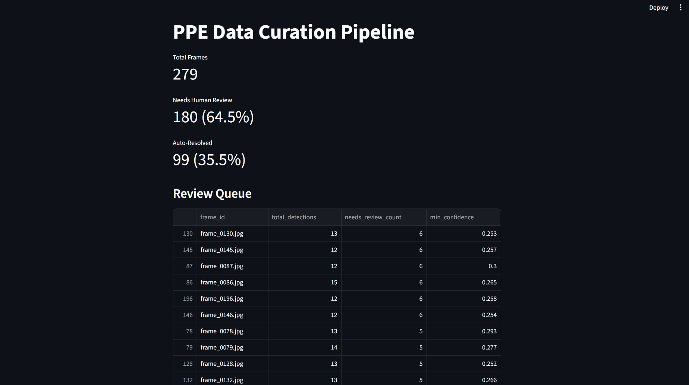
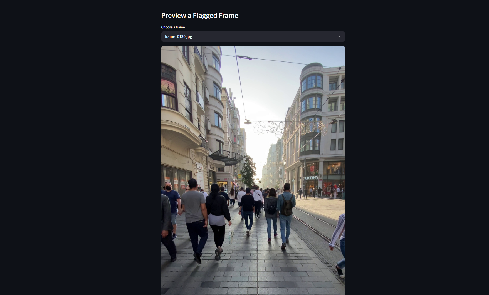

# PPE Data Curation Pipeline

A human-in-the-loop data curation system for computer vision pipelines — 
automatically triages model detections by confidence and filters redundant 
video frames, so human reviewers only see the ~35% of frames that actually 
need attention instead of all of them.

## Dashboard

## Problem
CV pipelines producing detections at scale (e.g. video surveillance) generate 
far more output than a human can manually review. Naively reviewing every 
frame doesn't scale. This project builds the triage layer that decides what 
needs a human and what doesn't.

## Approach
1. Run YOLOv8 (pretrained) on video frames extracted at 1fps
2. Triage each detection by confidence into auto_accept / needs_review / reject
3. Aggregate to frame-level review flags (ratio-based, not just "any low-confidence")
4. Filter redundant frames using motion-based frame differencing (relative 
   thresholding — adapts to each video's own motion level rather than a 
   fixed cutoff)
5. Merge both signals into a final prioritized review queue

## Results
- 279 frames processed from test video
- 663 raw detections → 180 frames flagged for human review (64.5%)
- 99 frames (35.5%) auto-resolved or skipped as redundant — no human needed

## Key decisions
- Initial flag rule (any borderline detection = flag) was too permissive 
  (98% flag rate on real data) — switched to a ratio + severity-based rule
- Absolute pixel-diff threshold for duplicate detection didn't generalize 
  across different motion levels — switched to per-video relative (quantile-based) thresholding

## Stack
Python, YOLOv8 (ultralytics), OpenCV, pandas, Streamlit

## Run it
\`\`\`
pip install -r requirements.txt
python src/extract_frames.py
python src/detect_batch.py
python src/curate.py
python src/dedupe.py
python src/build_queue.py
streamlit run app.py
\`\`\`